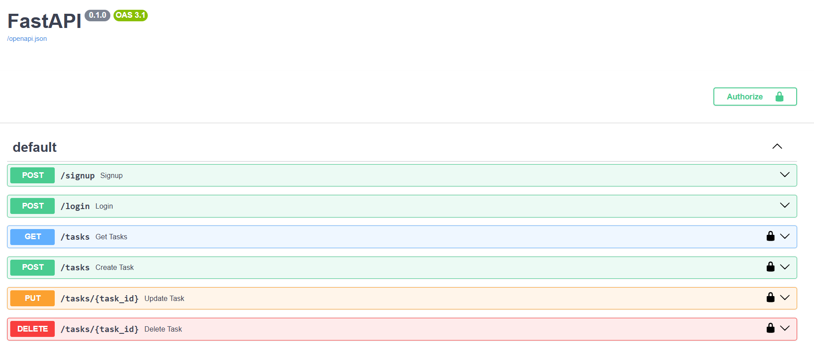
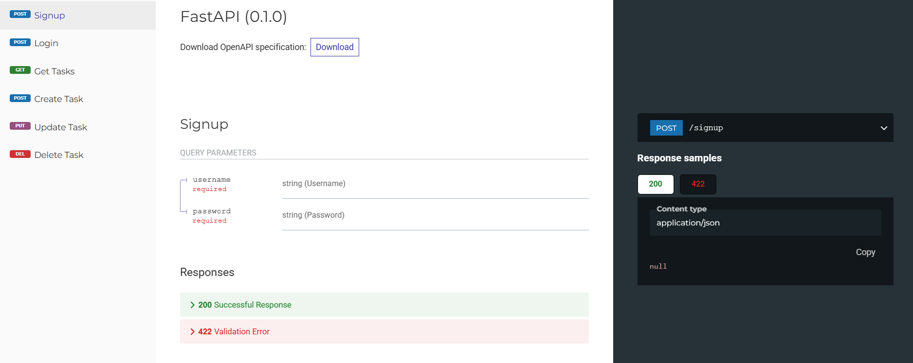
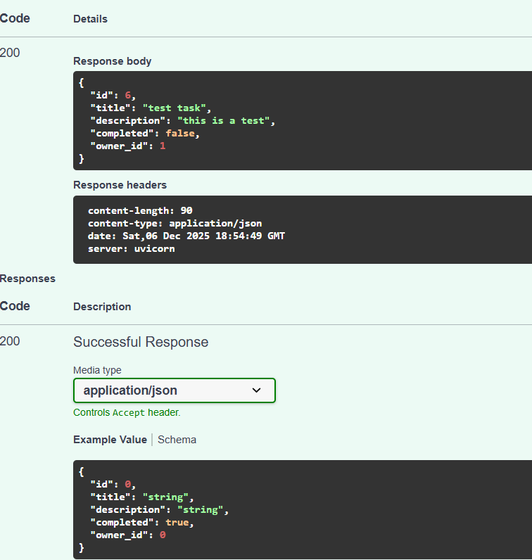

# TO-DO APP
### FastAPI + PostgreSQL + Docker


A backend application for managing tasks (To-Do) built with FastAPI, PostgreSQL, and Docker. Includes JWT authentication, full CRUD operations, API documentation with Swagger & Redoc, and quick deployment using Docker Compose.

___

## Features
- User registration and login with JWT authentication

- Full CRUD operations for tasks

- Interactive API documentation with Swagger and Redoc

- Quick setup and run with Docker & Docker Compose

- Seed data for testing

___

## Technologies
-**Backend:** FastAPI, SQLAlchemy, Pydantic

-**Database:** PostgreSQL

-**Authentication:** JWT (OAuth2 Password Flow)

-**Containerization:** Docker, Docker Compose

___

## Installation & Run

1️⃣ Clone the repository

```bash
git clone https://github.com/fargolazadi/todo-app-fastapi.git
cd todo-app-fastapi
```
2️⃣ Environment variables

Create a .env file in the project root and add:

```env
POSTGRES_USER=postgres
POSTGRES_PASSWORD=postgres
POSTGRES_DB=todo_db
DATABASE_URL=postgresql+psycopg2://postgres:postgres@db:5432/todo_db
```
3️⃣ Run with Docker Compose

‍‍‍‍‍‍```bash
docker-compose up --build‍‍‍‍‍```

4️⃣ Access services

 FastAPI: http://localhost:8000

 Swagger UI: http://localhost:8000/docs

 Redoc: http://localhost:8000/redoc

 PostgreSQL: available on port 5432

___

## Screenshots

### Swagger UI


### Redoc


### JSON


### Docker 

